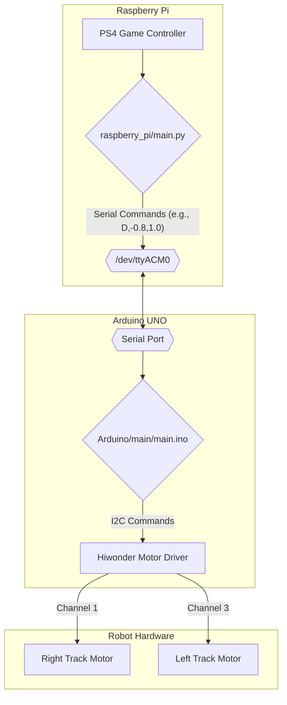

# Think Tank - Dual-Stick Robot Control System

A robust and professional software architecture for controlling a tracked mobile robot. This system uses a Raspberry Pi for high-level user input processing and an Arduino for real-time, low-level hardware control, communicating over a simple and reliable serial protocol.

## 🏗️ System Architecture

The architecture is designed for modularity and a clean separation of concerns. The Raspberry Pi handles all complex processing, including reading the game controller, while the Arduino acts as a dedicated hardware slave, translating commands into the I²C signals the motor driver understands.



-   **Raspberry Pi:** Runs the main Python script (`main.py`). It reads joystick input and sends simple command strings (e.g., `D,left_val,right_val\n`) to the Arduino.
-   **Arduino:** Listens for serial commands, parses them robustly using C-style strings, and sends I²C commands to the correct motor driver channels based on the confirmed hardware mapping.

## ✅ Final Hardware Configuration (Ground Truth)

After extensive testing, the definitive hardware mapping for this specific robot chassis is:

-   **Left Track Motor:** Connected to **Channel 3** on the Hiwonder driver. It requires a **POSITIVE** PWM value to move forward.
-   **Right Track Motor:** Connected to **Channel 1** on the Hiwonder driver. It requires a **NEGATIVE** PWM value to move forward.
-   **Channels 0 & 2** are unused.

The final Arduino code (`Arduino/main/main.ino`) is built exclusively around this configuration.

## ⚡ Quick Start

1.  **Hardware Setup:** Wire the robot according to the configuration above.
2.  **Upload Arduino Sketch:** Use the Arduino IDE to upload `Arduino/main/main.ino` to the Arduino Uno.
3.  **Run Pi Script:** Connect your game controller to the Raspberry Pi, then activate the virtual environment and run the main Python script.

```bash
# Navigate to the project root
cd /path/to/Think-Tank

# Activate the Python virtual environment
source robot_venv/bin/activate

# Navigate to the Python script directory
cd raspberry_pi

# Run the controller script
python3 main.py
```

## 🔧 Requirements

-   **Raspberry Pi** (4, 5, or similar)
-   **Arduino Uno**
-   **Hiwonder 4-Channel I²C Motor Controller**
-   **Two DC motors** for the tracks
-   **PS4-style Game Controller** (or other, axes may need re-mapping)
-   Appropriate power system for logic and motors.

## 📦 Installation

### 1. Raspberry Pi Setup

```bash
# Clone the repository
git clone https://github.com/jugddd/Think-Tank.git
cd Think-Tank

# Create and activate a Python virtual environment
python3 -m venv robot_venv
source robot_venv/bin/activate

# Install system-level dependencies for Pygame
sudo apt-get update
sudo apt-get install -y libsdl2-dev

# Install required Python packages
pip install pyserial pygame
```

### 2. Arduino Setup

1.  Open the Arduino IDE.
2.  Ensure you have the standard `Wire.h` library (included by default).
3.  Open the sketch: `Arduino/main/main.ino`.
4.  Select your Board (**Arduino Uno**) and Port (e.g., `/dev/ttyACM0`).
5.  Click **Upload**.

## 🎮 Controls

The system implements a standard dual-stick (tank) drive.

| Input                | Function                      |
| -------------------- | ----------------------------- |
| **Left Stick Y-Axis**  | Control Left Track Motor      |
| **Right Stick Y-Axis** | Control Right Track Motor     |
| **Button 0 ('X')**     | Toggle future AI / Manual Mode|
| **Button 8 ('Start')** | Emergency Stop                |

*Note: Joystick axes are defined in `raspberry_pi/main.py` and can be changed to suit different controllers.*

## 🛠️ Troubleshooting

-   **"No joystick detected"**: Ensure your controller is connected and recognized by the Raspberry Pi OS before running the script.
-   **"Could not connect to Arduino"**:
    -   Verify the Arduino is plugged in. The `dmesg` command can show if a USB device is connecting/disconnecting.
    -   Check that the `SERIAL_PORT` variable in `raspberry_pi/main.py` matches the Arduino's port (e.g., `/dev/ttyACM0` or `/dev/ttyUSB0`).
-   **Motors not responding after a new Arduino board**:
    -   Ensure the new board has successfully uploaded the `Arduino/main/main.ino` sketch.
    -   Double-check the I²C wiring between the Arduino (SDA->A4, SCL->A5) and the motor driver.
-   **`avrdude: programmer is not responding`**: This is a fatal hardware error. It indicates the Arduino's main microcontroller has been damaged (likely by a short circuit) and the board must be replaced. 