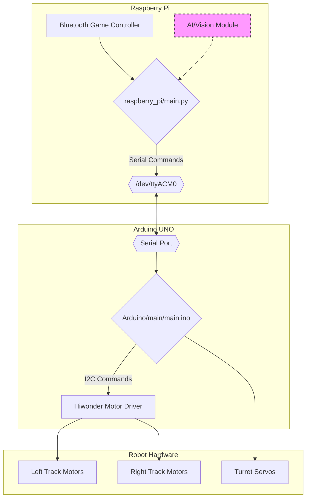

# Think Tank - Mobile Robot Control System

A professional and robust software architecture for controlling a tracked mobile robot. This system uses a Raspberry Pi for high-level logic and an Arduino for real-time hardware control, communicating over a simple and reliable serial protocol.

## 🏗️ System Architecture

The architecture is designed for modularity and a clean separation of concerns. The Raspberry Pi handles all complex processing, including user input and future AI/vision tasks, while the Arduino acts as a dedicated hardware slave.



-   **Raspberry Pi:** Runs the main Python script. It reads controller input, manages control modes (manual vs. AI), and sends simple command strings (e.g., `D,1.0,-0.5`) to the Arduino.
-   **Arduino:** Listens for serial commands, parses them, and translates them into the low-level I²C signals required by the Hiwonder motor driver and direct PWM signals for servos.

## ⚡ Quick Start

1.  Ensure the hardware is wired and the Arduino sketch is uploaded.
2.  Connect your game controller to the Raspberry Pi.
3.  Activate the virtual environment and run the main script.

```bash
# Navigate to the project root
cd /path/to/Think-Tank

# Activate the virtual environment
source robot_venv/bin/activate

# Navigate to the Python script directory
cd raspberry_pi

# Run the controller
python3 main.py
```

## 🔧 Hardware Requirements

- **Raspberry Pi** (4, 5, or similar) with Raspberry Pi OS
- **Arduino Uno** connected via USB
- **Hiwonder 4-Channel I²C Motor Controller**
- **Two DC encoder motors**
- **Pan/Tilt servo motors** (optional)
- **Bluetooth or USB Game Controller** (e.g., PS4, Xbox)
- Appropriate power system for logic and motors.

## 📦 Installation

### 1. Raspberry Pi Setup

```bash
# Clone the repository
git clone https://github.com/jugddd/Think-Tank.git
cd Think-Tank

# Create and activate a Python virtual environment
python3 -m venv robot_venv
source robot_venv/bin/activate

# Install system-level dependencies required for Pygame
sudo apt-get update
sudo apt-get install -y libsdl2-dev libsdl2-image-dev libsdl2-mixer-dev libsdl2-ttf-dev libportmidi-dev libfreetype6-dev python3-dev

# Install Python packages
pip install -r raspberry_pi/requirements.txt
```

### 2. Arduino Setup

1.  Open the Arduino IDE.
2.  Go to `Tools -> Manage Libraries...` and install the official **"Servo"** library.
3.  Open the sketch: `Arduino/main/main.ino`.
4.  Select your Board (**Arduino Uno**) and Port (e.g., `/dev/ttyACM0`).
5.  Click **Upload**.

## 🎮 Usage

Once the `main.py` script is running, it will automatically connect to the Arduino and the first detected joystick.

### Default Controls

| Input                  | Function                 |
| ---------------------- | ------------------------ |
| **Left Stick Y-Axis**  | Forward/Backward Throttle|
| **Right Stick X-Axis** | Left/Right Steering      |
| **Button 'A' / 0**     | Toggle AI / Manual Mode  |
| **Start Button / 8**   | Emergency Stop           |

*Note: Button and axis mappings can be easily changed in `raspberry_pi/main.py`.*

## 📡 Serial Communication Protocol

The communication between the Pi and Arduino is human-readable and easy to debug. All commands are terminated by a newline character (`\n`).

| Command | Format                 | Example             | Description                                   |
|---------|------------------------|---------------------|-----------------------------------------------|
| **Drive** | `D,<throttle>,<steer>` | `D,0.8,-0.25`       | Controls the tank tracks. Throttle and steer are floats from -1.0 to 1.0. |
| **Turret**| `T,<pan>,<tilt>`       | `T,90,45`           | Controls the pan/tilt servos. Angles are integers from 0 to 180.         |
| **Stop**  | `S`                    | `S`                 | Immediately stops all motors.                 |

## 🛠️ Troubleshooting

-   **"No joystick detected"**: Ensure your controller is connected and recognized by the Raspberry Pi before running the script.
-   **"Error connecting to Arduino"**:
    -   Verify the Arduino is plugged in.
    -   Check that the `SERIAL_PORT` variable in `raspberry_pi/main.py` matches the Arduino's port (e.g., `/dev/ttyACM0` or `/dev/ttyUSB0`). You can find it by running `ls /dev/tty*`.
    -   Ensure you have the correct permissions: `sudo usermod -a -G dialout $USER` (requires logout/login to apply).
-   **Motors not responding**:
    -   Check motor power supply.
    -   Verify I²C wiring between the Arduino and the motor driver (SDA->A4, SCL->A5). 